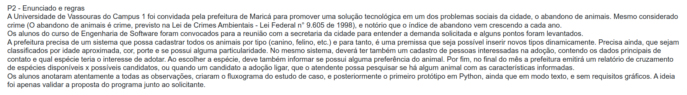
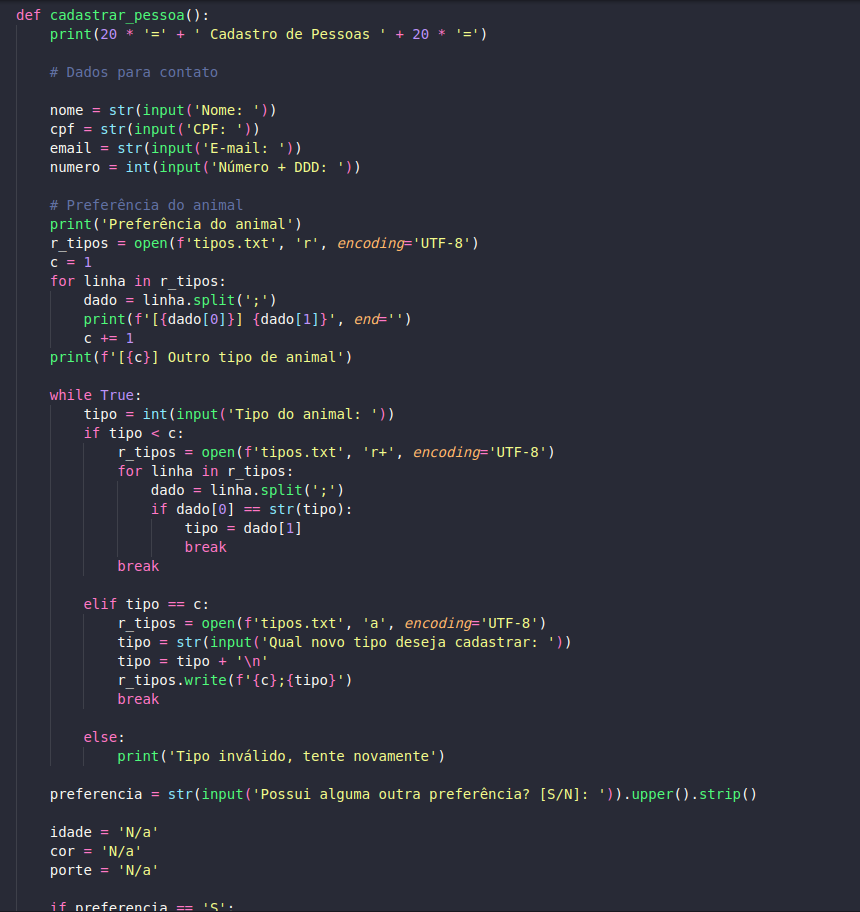

# Sobre a Disciplina.
Curso: Engenharia de Software 3º Período
Alunos: João Pedro Espindola de Mendonça & Gabriel da Silva Neves.
Disciplina: Estrutura de Dados 
Professor: Marcio Garrido
# Enunciado.

# Projeto P2 Estrutura De Dados.

Na imagem acima vemos a função de cadastro de animais. Ela serve para adicionar o **tipo, idade, cor, porte e particularidade do animal**. Estamos também salvado esses dados como **txt**.

Na imagem acima vemos a função de cadastro de pessoas. Ela serve para adicionar o **nome, cpf, e-mail, numero e preferência do animal**. Estamos também salvado esses dados como **txt**. A preferenência do animal contém tudo da primeira *função de cadastro de animais*.

**Ainda em construção.**
Lorem ipsum dolor sit amet, consectetur adipiscing elit. Sed faucibus facilisis viverra. Sed elementum nisi at lacus scelerisque, in sodales orci pulvinar. Donec laoreet nisi id ligula hendrerit, quis vehicula ante congue. Fusce eu risus maximus, cursus nunc quis, bibendum lectus. Quisque pretium orci in tellus tempus, sed dapibus ligula semper.
### Pré-requisitos:
* Python Version 3.10.6
### Funcionalidades a desenvolver:
1. Cadastro de animais por tipos.
2. Tenha a possibilidade de cadastrar novos animais.
3. Classificação por idade aproximada, cor, porte e se possuem particularidade.
4. Cadastro de pessoas com interesse em adoção, contendo os dados principais de contato e qual espécie tem interesse de adotar.
5. A pessoa que escolher a espécie, deve informar ao sistema se possui alguma preferência de animal.
6. Mensalmente o sistema tem que emitir um relatório de cruzametno de espécies disponíveis e possíveis candidatos.
7. Ter uma função de pesquisa que permita a atendente pesquisar se há algum animal com as características informadas.

### Lista de tarefas a fazer:
-[X] Cadastro de animais por tipos.  
-[X] Tenha a possibilidade de cadastrar novos animais.  
-[X] Classificação por idade aproximada, cor, porte e se possuem particularidade.  
-[X] Cadastro de pessoas com interesse em adoção, contendo os dados principais de contato e qual espécie tem interesse de adotar.  
-[X] A pessoa que escolher a espécie, deve informar ao sistema se possui alguma preferência de animal.  
-[ ] Mensalmente o sistema tem que emitir um relatório de cruzamento de espécies disponíveis e possíveis candidatos.  
-[X] Ter uma função de pesquisa que permita a atendente pesquisar se há algum animal com as características informadas.  

# Como executar:
1 - Clone o repositório ou baixe o arquivo nome_arquivo.py. </pre>
2 - Abra o terminal e navegue até o diretório do arquivo. 
3 - Execute o arquivo digitando python nome_arquivo.py. 
4 - Digite o número correspondente à opção desejada: 
<pre>1: Executa a função **ainda em construção()** uma vez. 
2: Executa a função **ainda em construção()** 
0: Sai do programa. </pre>   
    
# Análise de complexidade.
Os métados utilizados como **ainda em construção()**
# Autor
Nome: João Pedro Espindola & Gabriel Neves 
GitHub: https://github.com/Joaoespindola1 & https://github.com/YukiTsuki12
