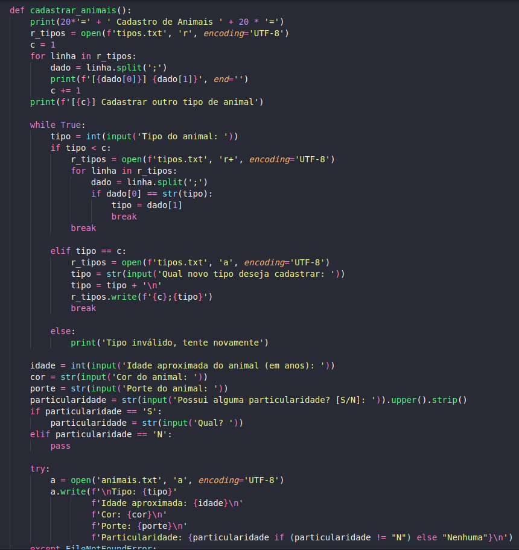

# Sobre a Disciplina.
Curso: Engenharia de Software 3º Período  
Professor: Marcio Alexandre Dias Garrido (https://github.com/marciogarridoLaCop)  
Alunos: João Pedro Espindola de Mendonça & Gabriel da Silva Neves.  
Disciplina: Estrutura de Dados  

# Enunciado.
P2 - Enunciado e regras   
A Universidade de Vassouras do Campus 1 foi convidada pela prefeitura de Maricá para promover uma solução tecnológica em um dos problemas sociais da cidade, o abandono de animais. Mesmo considerado crime (O abandono de animais é crime, previsto na Lei de Crimes Ambientais - Lei Federal n° 9.605 de 1998), e notório que o índice de abandono vem crescendo a cada ano.
Os alunos do curso de Engenharia de Software foram convocados para a reunião com a secretaria da cidade para entender a demanda solicitada e alguns pontos foram levantados.  
A prefeitura precisa de um sistema que possa cadastrar todos os animais por tipo (canino, felino, etc.) e para tanto, é uma premissa que seja possível inserir novos tipos dinamicamente. Precisa ainda, que sejam classificados por idade aproximada, cor, porte e se possui alguma particularidade. No mesmo sistema, deverá ter também um cadastro de pessoas interessadas na adoção, contendo os dados principais de contato e qual espécie teria o interesse de adotar. Ao escolher a espécie, deve também informar se possui alguma preferência do animal. Por fim, no final do mês a prefeitura emitirá um relatório de cruzamento de espécies disponíveis x possíveis candidatos, ou quando um candidato a adoção ligar, que o atendente possa pesquisar se há algum animal com as características informadas.  
Os alunos anotaram atentamente a todas as observações, criaram o fluxograma do estudo de caso, e posteriormente o primeiro protótipo em Python, ainda que em modo texto, e sem requisitos gráficos. A ideia foi apenas validar a proposta do programa junto ao solicitante.

# Fluxograma

[fluxograma_p2.drawio.pdf](https://github.com/Joaoespindola1/p2-estrutura_de_dados/files/11728418/fluxograma_p2.drawio.pdf)

# Projeto P2 Estrutura De Dados.
    
Na imagem acima vemos a função de cadastro de animais. Ela serve para adicionar o **tipo, idade, cor, porte e particularidade do animal**. Estamos também salvado esses dados como **txt**.
   
    
Na imagem acima vemos a função de cadastro de pessoas. Ela serve para adicionar o **nome, cpf, e-mail, numero e preferência do animal**. Estamos também salvado esses dados como **txt**. A preferenência do animal contém tudo da primeira *função de cadastro de animais*.
 
   
Na imagem acima vemos a função serve para pesquisar os animais salvos no arquivo TXT.
 
   
Na imagem acima vemos a função serve para cruzar os dados dos animais com preferencia das pessoas e dizer qual são compativeis.
 

### Pré-requisitos:
* Python Version 3.10.6
### Funcionalidades a desenvolver:
1. Cadastro de animais por tipos.
2. Tenha a possibilidade de cadastrar novos animais.
3. Classificação por idade aproximada, cor, porte e se possuem particularidade.
4. Cadastro de pessoas com interesse em adoção, contendo os dados principais de contato e qual espécie tem interesse de adotar.
5. A pessoa que escolher a espécie, deve informar ao sistema se possui alguma preferência de animal.
6. Mensalmente o sistema tem que emitir um relatório de cruzametno de espécies disponíveis e possíveis candidatos.
7. Ter uma função de pesquisa que permita a atendente pesquisar se há algum animal com as características informadas.

### Lista de tarefas a fazer:
-[X] Cadastro de animais por tipos.  
-[X] Tenha a possibilidade de cadastrar novos animais.  
-[X] Classificação por idade aproximada, cor, porte e se possuem particularidade.  
-[X] Cadastro de pessoas com interesse em adoção, contendo os dados principais de contato e qual espécie tem interesse de adotar.  
-[X] A pessoa que escolher a espécie, deve informar ao sistema se possui alguma preferência de animal.  
-[X] Mensalmente o sistema tem que emitir um relatório de cruzamento de espécies disponíveis e possíveis candidatos.  
-[X] Ter uma função de pesquisa que permita a atendente pesquisar se há algum animal com as características informadas.  

# Como executar:
1 - Clone o repositório ou baixe o arquivo nome_arquivo.py. </pre>
2 - Abra o terminal e navegue até o diretório do arquivo. 
3 - Execute o arquivo digitando python main.py. 
4 - Digite o número correspondente à opção desejada: 
0: Sai do programa. </pre>   

# Autor
Nome: João Pedro Espindola & Gabriel Neves  
GitHub: https://github.com/Joaoespindola1 & https://github.com/YukiTsuki12
